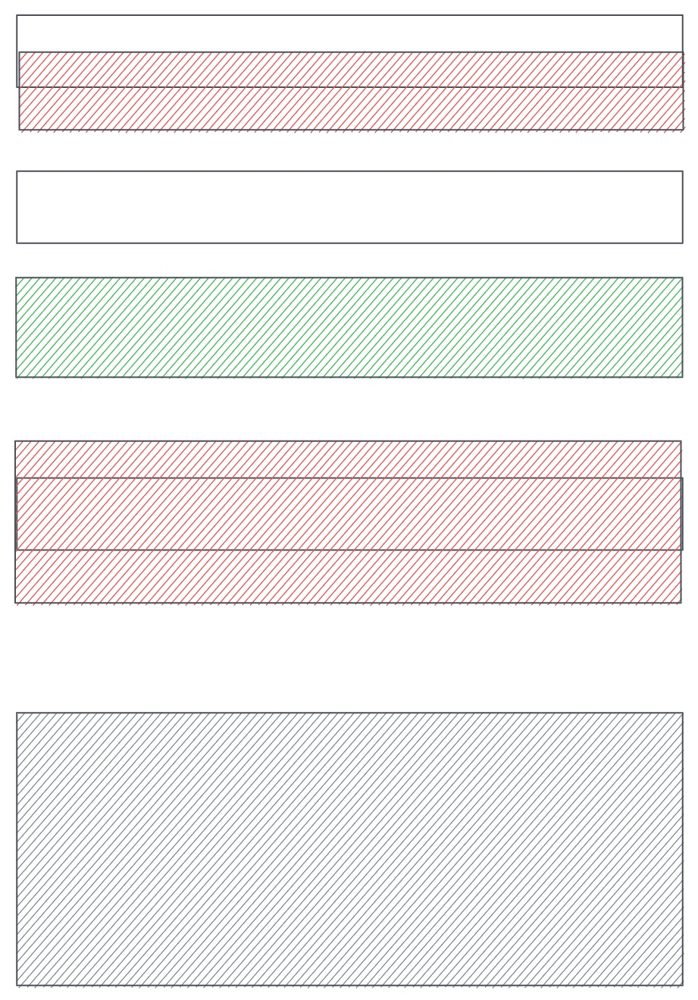

# Core Reservation Service

- Feature name: core-reservation-service
- Start Date: 2023-05-25 04:08:40

## Summary

A core reservation service that solves the problem of reserving a resource for a period of time. We leverage postgres EXCLUDE constrations to ensure that only one reservation can be made for a given resource at a given time.

## Motivation

We need a common solution for various reservation requirements: 1) calender booking; 2) hotel/room booking;
3) meeting room booking; 4) parking lot booking; 5) etc. Repeatedly building features for these requirements is a waste of time and resources. We should have a common solution that can be used by all teams.

## Guide-level explanation

Basic architecture:


### Service Interface

We would use gRPC as a service interface. Below is the proto definition:

```protobuf
syntax = "proto3";

enum ReservationStatus {
    UNDEFINED = 0;
    PENDING = 1;
    CONFIRMED = 2;
    BLOCKED = 3;
}

enum ReservationUpdateType {
    UNDEFINED = 0;
    CREATE = 1;
    UPDATE = 2;
    DELETE = 3;
}

message Reservation {
    string id = 1;
    string user_id = 2;
    ReservationStatus status = 3;

    // resource reservation window
    string resource_id = 4;
    google.protobuf.Timestamp start = 5;
    google.protobuf.Timestamp end = 6;

    // extra note
    string note = 7;
}

message ReserveRequest {
    Reservation reservation = 1;
}

message ReserveResponse {
    Reservation reservation = 1;
}

message ConfirmRequest {
    string id = 1;
}

message ConfirmResponse {
    Reservation reservation = 1;
}

message UpdateRequest {
    string note = 1;
}

message UpdateResponse {
    Reservation reservation = 1;
}

message CancelRequest {
    string  id = 1;
}

message CancelResponse {
    Reservation reservation = 1;
}

message GetRequest {
    string id = 1;
}

message GetResponse {
    Reservation reservation = 1;
}

message QueryRequest {
    string resource_id = 1;
    string user_id = 2;
    // use status to filter reservations
    ReservationStatus status = 3;
    google.protobuf.Timestamp start = 4;
    google.protobuf.Timestamp end = 5;
}

message ListenRequest {}
message ListenResponse {
    int8 type = 1;
    Reservation reservation = 2;
}

service ReservationService {
    rpc reserve(ReserveRequest) returns (ReserveResponse);
    rpc confirm(ConfirmRequest) returns (ConfirmResponse);
    rpc update(UpdateRequest) returns (UpdateResponse);
    rpc cancel(CancelRequest) returns (CancelResponse);
    rpc get(GetRequest) returns (GetResponse);
    rpc query(QueryRequest) returns (stream Reservation);
    rpc listen(ListenRequest) returns (stream Reservation);
}

```

### Database Schema

we use postgres as the database. Below is the table definition:

```sql
CREATE SCHEMA rsvp;
CREATE TYPE rsvp.reservation_status AS ENUM ('unknown', 'pending', 'confirmed', 'blocked');
CREATE TYPE rsvp.reservation_update_type AS ENUM ('unknown', 'create', 'update', 'delete');

CREATE TABLE rsvp.reservations (
    id uuid NOT NULL DEFAULT uuid_generate_v4(),
    user_id VARCHAR(64) NOT NULL,
    status rsvp.reservation_status NOT NULL DEFAULT 'pending',

    resource_id VARCHAR(64) NOT NULL,
    -- tstzrange is a postgres type that represents a time range [start, end]
    timespan TS NOT NULL,

    note TEXT,

    CONSTRAINT reservations_pkey PRIMARY KEY (id),
    -- gist index for exclusion constraint
    CONSTRAINT reservation_conflict EXCLUDE USING gist (resource_id WITH =, timespan WITH &&),
    -- created_at TIMESTAMP NOT NULL DEFAULT CURRENT_TIMESTAMP,
    -- updated_at TIMESTAMP NOT NULL DEFAULT CURRENT_TIMESTAMP,
);
CREATE INDEX reservations_user_id_idx ON rsvp.reservations (user_id);
CREATE INDEX reservations_resource_id_idx ON rsvp.reservations (resource_id);

-- if user_id is null, find all reservations within during for the resource
-- if resource_id is null, find all reservations during the time span for the user
-- if both user_id and resource_id are null, find all reservations during the time span
-- if both set, find all reservations for the user and resource during the time span
CREATE OR REPLACE FUNCTION rsvp.query(uid text, rid text, ts: tstzrange) RETURNS TABLE rsvp.reservations AS $$ $$ LANGUAGE plpgsql;

-- reservation change queue
CREATE TABLE rsvp.reservation_changes (
    id SERIAL NOT NULL,
    reservation_id uuid NOT NULL,
    op rsvp.reservation_update_type NOT NULL,
);

-- trigger for add/update/delate reservation
CREATE OR REPLACE FUNCTION rsvp.reservation_trigger() RETURNS TRIGGER AS
$$
BEGIN
    IF (TG_OP = 'INSERT') THEN
        -- update reservation_changes table
        INSERT INTO rsvp.reservation_changes (reservation_id, op) VALUES (NEW.id, 'create');
    ELSIF (TG_OP = 'UPDATE') THEN
        -- if status is changed, update reservation_changes table
        IF (OLD.status <> NEW.status) THEN
            INSERT INTO rsvp.reservation_changes (reservation_id, op) VALUES (NEW.id, 'update');
        END IF;
    ELSIF (TG_OP = 'DELETE') THEN
        -- if status is deleted, update reservation_changes table
        INSERT INTO rsvp.reservation_changes (reservation_id, op) VALUES (OLD.id, 'delete');
    END IF;
    -- notify a channel called reservation_update
    NOTIFY reservation_update;
    RETURN NULL;
END;
$$
```

Here we use EXCLUDE constraint provided by postgres to ensure that on overlapping reservations cannot be made for a given resource at a given time.

```sql
CONSTRAINT reservations_conflict EXCLUDE USING gist (resource_id WITH =, timespan WITH &&)
```


We also use a trigger to notify a channel when a reservation is added/updated/deleted. To make sure even we missed certain messages from the channel when DB connection is down for some reason, we use a queue to store reservation changes. Thus when we receive a notification, we can query the queue to get all the changes since last time we checked, and once we finished processing all the changes, we can delete them from the queue.


## Core flow


## Reference-level explanation
TDB

## Drawbacks
[drawbacks]: #drawbacks

N/A


## Rationale and alternatives
N/A

## Prior art
N/A

## Unresolved questions
- how to handle repeated reservation? - we can use a cron job to clean up the repeated reservations, or we can use a trigger to clean up the repeated reservations when a new reservation is created. Is this more or less a business logic which should be handled by the client? Is it should be put into this layer?
- if load is big, how to scale? use external queue for recording changes? - we can use a sharding strategy to scale the service. For example, we can use the resource_id to shard the reservations. All reservations for a given resource will be stored in the same shard. We can use a consistent hashing algorithm to map the resource_id to a shard.
- we haven't considered observability/deployment yet. We can use prometheus to monitor the service. We can use k8s to deploy the service. We can use istio to manage the traffic.
- query performance - we can use a materialized view to improve the query performance. We can use a cache to improve the query performance. We can use a search engine to improve the query performance.

## Future possibilities
TDB
